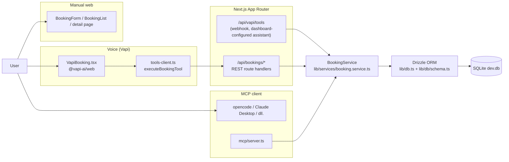
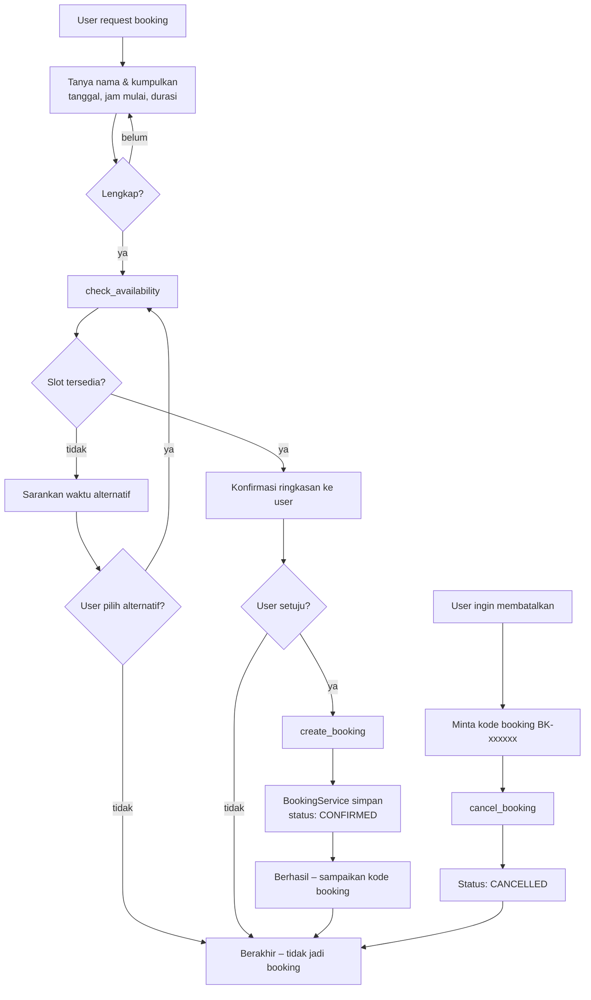

# Simple Voice Booking

Voice-powered meeting room booking demo built with Next.js (App Router) + Vapi AI voice + Drizzle ORM (SQLite).

Users book a meeting room by talking to an AI assistant ("Book your meeting room using AI voice"), with a manual form fallback and a booking list/detail/cancel flow. An MCP (Model Context Protocol) server exposes the same booking domain to AI assistants.

## Stack

- **Next.js 16** (App Router, Route Handlers) + React 19 + TypeScript (strict)
- **Tailwind CSS 4**
- **Vapi** Web SDK (`@vapi-ai/web`) — voice + tool calling
- **Drizzle ORM** with `better-sqlite3` (SQLite in dev)
- **MCP** (`@modelcontextprotocol/sdk`, stdio) — booking tools for AI clients
- **Vitest** for unit tests

## Docs

- `docs/PRD.md` — product requirements (tools, UI wireframes, rules, phases)
- `docs/SRS.md` — software requirements + canonical API error contract
- `docs/CHECKLOG.md` — live phase/acceptance-criteria tracker
- `docs/ERRORLOG.md` — error log

## Architecture

### Data flow



### Business flow



## Getting Started

```bash
npm install
cp .env.example .env   # then fill in your Vapi keys
npm run db:migrate
npm run db:seed        # creates default "Meeting Room A"
npm run dev
```

Open http://localhost:3000.

## Environment Variables

| Variable | Description |
| --- | --- |
| `DATABASE_URL` | SQLite file for Drizzle, e.g. `file:./dev.db` |
| `NEXT_PUBLIC_VAPI_PUBLIC_KEY` | Vapi public key (client-safe, required for web calls) |
| `NEXT_PUBLIC_VAPI_ASSISTANT_ID` | Optional pre-configured assistant ID; if empty the inline assistant in `lib/vapi/assistant.ts` is used |
| `VAPI_PRIVATE_KEY` | Vapi private key, server-only (reserved; not sent to the browser) |
| `VAPI_TOOL_SECRET` | Optional shared secret for the `/api/vapi/tools` webhook |

## Scripts

```bash
npm run dev         # dev server
npm run build       # production build
npm run start       # serve production build
npm run lint        # eslint
npm run typecheck   # tsc --noEmit
npm test            # vitest
npm run db:generate # drizzle-kit generate
npm run db:migrate  # drizzle-kit migrate
npm run db:push     # drizzle-kit push
npm run db:seed     # seed resources
npm run db:mcp      # run MCP server (stdio) manually
```

## API

| Method | Route | Notes |
| --- | --- | --- |
| `GET` | `/api/bookings` | List bookings (newest first) |
| `POST` | `/api/bookings` | Create booking (`name`, `date`, `startTime`, `duration`) |
| `POST` | `/api/bookings/availability` | Check slot availability |
| `GET/PATCH` | `/api/bookings/[id]` | Detail (numeric id or `BK-xxxxxx`); PATCH with `{ "status": "CANCELLED" }` |
| `POST` | `/api/vapi/tools` | Server-tool webhook for Vapi assistants |

Errors follow the envelope in `docs/SRS.md`: `{ "error": { "code", "message" } }`.

## Vapi Setup

1. Create a Vapi account and web-call project (public key).
2. Set `NEXT_PUBLIC_VAPI_PUBLIC_KEY`. The app uses an inline assistant (system prompt + `check_availability` / `create_booking` / `cancel_booking` tools) from `lib/vapi/assistant.ts`. For a pre-built assistant, set `NEXT_PUBLIC_VAPI_ASSISTANT_ID`.
3. Client tool calls are executed against this app's API from `components/VapiBooking.tsx` (`lib/vapi/tools-client.ts`). For dashboard-configured assistants, configure each tool with `server` pointing to `/api/vapi/tools` instead.

## MCP Server

An MCP (Model Context Protocol) stdio server (`mcp/server.ts`) exposes the same booking domain to AI clients, backed by the shared `BookingService`:

| Tool | Description |
| --- | --- |
| `list_resources` | List meeting rooms / resources |
| `check_availability` | Check a date/time/duration slot |
| `list_bookings` | List bookings (optional `status`, `date` filter) |
| `get_booking` | Booking detail by numeric id or `BK-xxxxxx` |
| `create_booking` | Create a booking (validates conflicts / past slots) |
| `cancel_booking` | Cancel a booking |

Run manually with `npm run db:mcp`, or add to any MCP client. This repo registers it in `opencode.json` as `booking-db` (local, `npx tsx mcp/server.ts`).

## Deployment

- Production build is cache-safe and tested (`npm run build`). SQLite is fine for the demo; for multi-region deployment, swap the Drizzle provider to PostgreSQL (see `docs/PRD.md` Phase 7 and `docs/SRS.md`).
- Never expose `VAPI_PRIVATE_KEY` / `VAPI_TOOL_SECRET` to the browser (`NEXT_PUBLIC_` prefix only for public values).